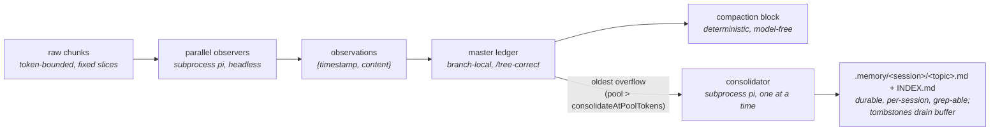

# observational-memory

Tiered, subprocess-backed memory for pi.

Parallel **observers** distill raw conversation chunks into atomic observations committed to the master's branch-local **ledger** (so memory stays correct under `/tree`); a deterministic, model-free **compaction** renders that buffer verbatim into the compaction block. A **consolidator** promotes the oldest observations into durable `.memory/<sessionId>/` topic files, bounding the buffer and giving each session its own durable, `grep`-able long-term memory (a fork seeds its memory from its parent).

## Installation

Install from this repository with pi's package manager:

```bash
pi install git:github.com/amosblomqvist/pi-observational-memory
```

- Add `-l` to install project-local instead of globally (writes to `.pi/settings.json`):
  `pi install git:github.com/amosblomqvist/pi-observational-memory -l`
- Pin a tag or commit with `@<ref>`: `pi install git:github.com/amosblomqvist/pi-observational-memory@v1`
- Remove with `pi remove git:github.com/amosblomqvist/pi-observational-memory`

The extension is **off by default** after install — turn it on per session with `/om` (see below).

## On/off gate (default OFF)

The extension ships in the global extensions folder during development, so it is **gated off
per session** and is completely invisible until you turn it on.

- `/om` — toggle for this session
- `/om on` / `/om off` — set explicitly

State persists per session in the ledger (`om.enabled`) and survives resume. When off, every
trigger, hook, widget, and subprocess returns immediately.

## How it works



Pipeline: raw chunks → observers → observations → ledger → compaction block, with a
consolidator draining the oldest observations into durable per-session memory files.

- **Observer clock** (`turn_end` / `agent_start`): every `chunkTokens` of new raw history,
  cut a fixed-token slice and fire an observer subprocess. Observers are embarrassingly
  parallel pure mappers (capped by `observerConcurrency`); each commits its own
  `coversUpToId` watermark, so out-of-order completion is fine.
- **Observation** = `{ timestamp, content, tokenCount }`. The precise event-`timestamp`
  doubles as the id; the orchestrator re-derives a unique, second-resolution id at commit
  (the observer only emits minute resolution).
- **Compaction** (`agent_end` over `compactAtContextTokens`, when idle): waits for in-flight
  observers, then renders the active buffer plus a **memory map** (rendered live from
  `.memory/<session>/` topic front-matter) and a **journey** section (`.memory/<session>/JOURNEY.md`, read
  verbatim). The cutoff snaps to an observation chunk boundary so the verbatim tail is never
  double-represented.
- **Consolidator clock** (`turn_end` / `agent_start`): when the active observation pool
  exceeds `consolidateAtPoolTokens`, a single background consolidator subprocess folds the
  **oldest** observations (above `poolTargetTokens`) into durable `.memory/<session>/<topic>.md`
  files, then the orchestrator tombstones exactly the observations it reports — draining the
  buffer back toward target. Topic files are **scoped per session** (`.memory/<sessionId>/`,
  keyed by the immutable session-header id, so two sessions in the same project never share
  output) and track the session, not the branch: they are **not** rolled back by `/tree`. On a
  fork/clone the new session's memory is **seeded once** from the parent (matching the ledger,
  which already travels with the fork). The orchestrator owns `INDEX.md` and re-renders it from
  topic front-matter after each run; the consolidator touches `<topic>.md` files plus
  `JOURNEY.md`, via its own `read`/`write`/`edit`/`ls`/`grep` tools scoped to the session dir.
- **Journey** (`.memory/<session>/JOURNEY.md`): a single, whole-project, purely **descriptive** prose
  history of how the work got to its current state, maintained by the consolidator and pushed
  into every compaction block for **orientation** (not recall, not instructions). It is
  append-mostly: each consolidation adds a short dated segment and compresses the oldest
  segments only once the file exceeds `journeyTargetTokens`, so recent history stays detailed
  and the section stays bounded. Like the topic files it does **not** roll back under `/tree`.

Each worker is an **ordinary recorded pi session** in the global store
(`~/.pi/agent/sessions`, under the project path) — open it in the session browser to see the
exact input chunk, tool calls, and output. Transient handoff files live in
`<project>/.memory/<sessionId>/.runs/`.

### Cost tracking

Every worker is a `pi` subprocess, so its spend is captured from pi's **built-in**
`usage.cost.total` (reliable, already computed). The worker extension — *not* the model —
accumulates that figure and hands it back via the run's cost file
(`.memory/<session>/.runs/<runId>.cost.json`), alongside the existing observation IPC. The orchestrator
folds each run into an `om.cost` ledger entry.

- **Ephemeral-safe:** cost rides the result-file IPC, never a saved session log, so it works
  even if a worker session is not persisted.
- **Never rolls back:** the running total sums *all* `om.cost` entries across the whole
  session (every branch), so real money spent does not decrease under `/tree` — the same
  tier rule as the `.memory/` files.
- **Surfaced** in the footer (`$0.000`, right of the gauges) and in `/om:status`
  (`session cost: $X (N runs)`). Survives resume.

## Commands

| Command | Effect |
|---|---|
| `/om`, `/om on`, `/om off` | The per-session on/off gate |
| `/om:status` | Workers in flight, active observation count, next-observer progress, pool/consolidator state, topic-file count, journey size, context usage, **session cost**, last error |
| `/om:compact` | Force a compaction now (ignores the threshold) |
| `/om:consolidate` | Force a consolidation now (ignores the pool threshold) |

## Configuration

Namespace `observational-memory` in `~/.pi/agent/settings.json` (global) or
`.pi/settings.json` (project; overrides global):

```jsonc
{
  "observational-memory": {
    "chunkTokens": 5000,
    "chunkOverlapTokens": 0,
    "poolTargetTokens": 10000,           // buffer drains back toward this after consolidation
    "consolidateAtPoolTokens": 20000,    // pool size that triggers a consolidation (200% of target)
    "compactAtContextTokens": 100000,    // tune per model
    "tailTokens": 20000,                 // verbatim tail; snaps to a chunk boundary
    "journeyTargetTokens": 1000,         // pushed JOURNEY.md size; compress oldest segments past this
    "observerConcurrency": 4,
    "models": {
      "observer":     { "model": "anthropic/claude-sonnet-4-6", "thinking": "low" },
      "consolidator": { "model": "anthropic/claude-sonnet-4-6", "thinking": "medium" }
    },
    "workerExtensions": [],
    "passive": false,
    "debugLog": false,
    "workerTimeoutMs": 1200000,           // hard cap per worker run (kill + free slot); 20 min default
    "workerIdleTimeoutMs": 0,             // no-output cap (catches a stalled provider); 0 = disabled (default)
    "consolidatorMaxConsecutiveFailures": 3, // consecutive failed consolidations that open the breaker
    "consolidatorRetryCooldownMs": 120000  // min interval between auto consolidation retries
  }
}
```

`workerExtensions` lists extra extension files loaded into every worker subprocess via `-e`
(in addition to the shared worker extension). Workers run with `--no-extensions`, so when a
worker model comes from a provider registered by an extension — e.g. `pi-gateway-discovery`
for corporate gateways — that extension must be listed here or the worker fails with
`Model "..." not found`:

```jsonc
{
  "observational-memory": {
    "models": {
      "observer":     { "model": "yoda/qwen3.8-27b", "thinking": "low" },
      "consolidator": { "model": "yoda/qwen3.8-27b", "thinking": "medium" }
    },
    "workerExtensions": ["~/.pi/agent/git/github.com/Carbyne/pi-gateway-discovery/src/index.ts"]
  }
}
```

`model` is the full model name — the exact value pi's `--model` flag takes (see
`pi --list-models`). The legacy `{ "provider": ..., "id": ... }` shape is still accepted
and is concatenated into `provider/id`.

`PI_OM_PASSIVE=1` forces `passive` (disables all triggers) for clean `/tree` testing.
`passive` is a power-user setting distinct from the on/off gate.

## Diagnosing stuck or looping workers

When an observer or consolidator seems wedged, there are three places to look — from
live to forensic:

1. **The live worker log (real-time).** Every worker run tees its `stdout` **and** `stderr`
   to `.memory/<sessionId>/.runs/<runId>.log` **as the bytes arrive**, so you can watch it
   while it runs:

   ```bash
   tail -f .memory/<sessionId>/.runs/<runId>.log
   ```

   `/om:consolidate` and `/om:status` point at the in-flight run's path. A run whose
   `.prompt.md` exists but whose `.result.json` (observers) never appears — or whose
   `.cost.json` keeps climbing — is a model looping on tool calls, not a hung process.

2. **The watchdog (auto-recovery).** `workerTimeoutMs` is a hard wall-clock cap (default **20
   min**); it kills a run that is still producing output but never finishes (a tool-call loop).
   `workerIdleTimeoutMs` is an opt-in no-output cap (**default `0` = disabled**, because it has
   false-killed genuinely slow runs behind a loaded provider); set it to catch a stalled provider
   that emits nothing. Either kill (SIGTERM→SIGKILL) records the failure as `last error` (in
   `/om:status` and an error toast) **and frees the worker's slot / clears the consolidator flag**
   so a wedged worker can never permanently block the pipeline. A model still producing output is
   bounded by the wall cap only. Set `workerTimeoutMs: 0` to disable the wall cap too.

3. **The recorded worker session (forensic).** Each worker is an ordinary recorded pi session
   under the memory-root cwd bucket, so open it in the session browser to see the exact chunk
   (as its user message), every tool call, and every reply — this is where a tool-call loop is
   unmistakable:

   ```
   ~/.pi/agent/sessions/--<cwd-with-slashes-as---->--.memory-<sessionId>--/
   ```

> `debugLog` is a **reserved** flag: the NDJSON writer (`src/debug-log.ts`) is implemented but
> not yet wired into the pipeline, so it currently emits nothing. The live worker log above is
> the supported path today.

> `debugLog` is a **reserved** flag: the NDJSON writer (`src/debug-log.ts`) is implemented but
> not yet wired into the pipeline, so it currently emits nothing. The live worker log above is
> the supported path today.

### Consolidator circuit breaker

A consolidation that **fails** (non-clean exit, timeout, or crash) does not drain the pool, so
the pool clock would otherwise re-dispatch the byte-identical batch on every tick forever —
hot-looping and burning cost on an un-drainable pool. The breaker stops that:

- `consolidatorMaxConsecutiveFailures` (default **3**): consecutive failures open the breaker;
  the auto-trigger then stops dispatching until it is reset. A successful consolidation **or** a
  manual `/om:consolidate` (an explicit operator retry) clears it. `0` disables the breaker.
- `consolidatorRetryCooldownMs` (default **120000**): while below the threshold, retries are
  paced by this cooldown so a flaky batch does not hammer between attempts. `0` disables pacing.

`/om:status` surfaces it: `consolidator: idle (2 failures; retry in 90s)` or
`consolidator: BLOCKED (3 consecutive failures; /om:consolidate to retry)`. While blocked the
pool keeps growing (compaction still works — it never waits for the consolidator); fix the cause
(e.g. inspect the failed run's recorded worker session) then `/om:consolidate`.

## Development

```bash
npm install
npm test          # vitest
npm run typecheck # tsc --noEmit
```

Layout: `src/` is the master-side orchestrator (entry `src/index.ts`); `agent/` is the shared
worker extension loaded into subprocesses via `-e` (`OM_WORKER=observer|consolidator`).
Long-term memory lives under `<project>/.memory/<sessionId>/` (`INDEX.md` + `<topic>.md` +
`JOURNEY.md`), keyed by the immutable session-header id so sessions in the same project stay
isolated; a fork seeds its dir from the parent's on first touch. Transient worker IPC lives
under `<project>/.memory/<sessionId>/.runs/`.